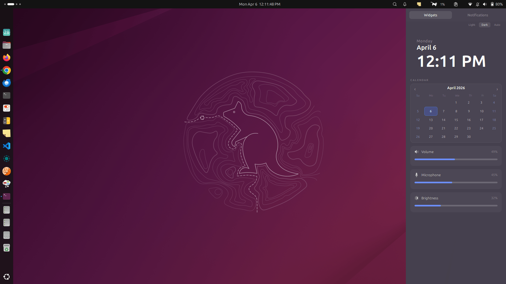
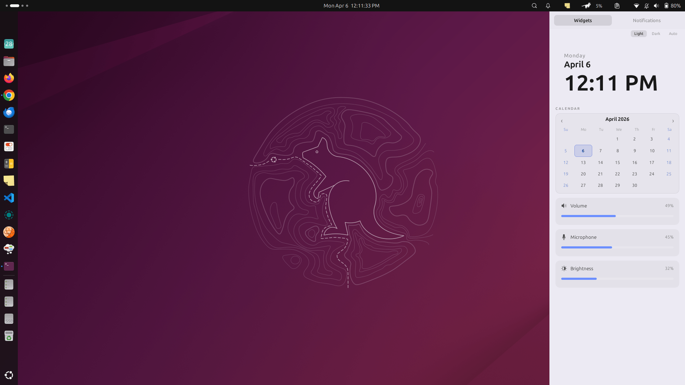

# Raven Sidebar

<p align="center">
  
</p>

A GNOME Shell extension that provides a unified right-side sidebar with calendar, clock, volume/microphone controls, and notifications.




## Features

- **Clock & Calendar** - Displays current date, time, and an interactive monthly calendar
- **Volume Control** - Quick access to system audio output volume
- **Microphone Control** - Quick access to microphone input volume
- **Notifications** - View and manage system notifications
- **Keyboard Shortcut** - Toggle sidebar with `Super + \` (backslash)
- **Theme Options** - Choose between system, dark, or light theme

## Requirements

- GNOME Shell 45+
- GJS (GNOME JavaScript)
- Gvc (GNOME Volume Control library)

## Installation

### From Source

```bash
git clone https://github.com/dalpat/raven-sidebar.git
cd raven-sidebar
./install.sh
```

Or manually:

```bash
mkdir -p ~/.local/share/gnome-shell/extensions/raven-sidebar@dalpat.github.io/
cp -r extension.js components/ stylesheet.css metadata.json schemas/ icons/ assets/ ~/.local/share/gnome-shell/extensions/raven-sidebar@dalpat.github.io/
```

### Enable the Extension

1. Open **Extensions** app
2. Find "Raven Sidebar" and enable it
3. Log out and log back in (required on Wayland)

### From GNOME Extensions (Coming Soon)

The extension will soon be available on the [GNOME Extensions](https://extensions.gnome.org) website. Once approved, you can install it directly from there.

## Usage

- Click the notification icon in the top-right panel to toggle the sidebar
- Press `Super + \` to toggle the sidebar via keyboard
- Switch between **Widgets** and **Notifications** tabs

## Configuration

Configure via `gsettings`:

```bash
# Set theme (system, dark, or light)
gsettings set org.gnome.shell.extensions.raven-sidebar theme dark

# Change keyboard shortcut
gsettings set org.gnome.shell.extensions.raven-sidebar toggle-raven "['<Super>n']"
```

## Building

No build step required - files are used directly as ES Modules.

## License

GNU General Public License v2 - see [LICENSE](LICENSE) file.

## Contributing

See [CONTRIBUTING.md](CONTRIBUTING.md).