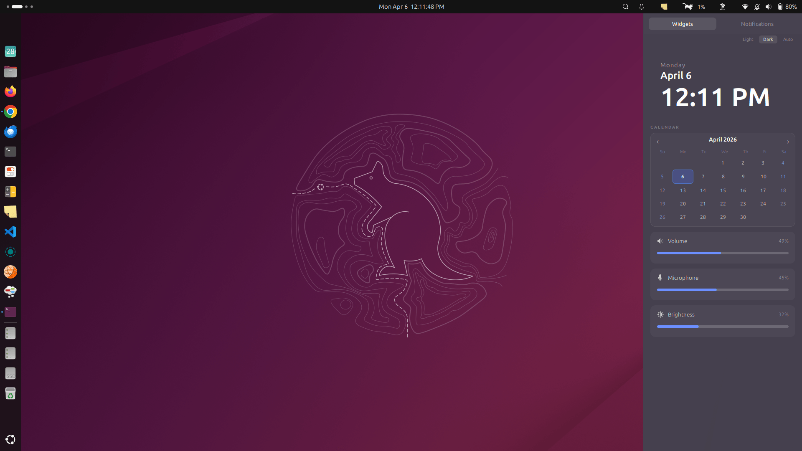
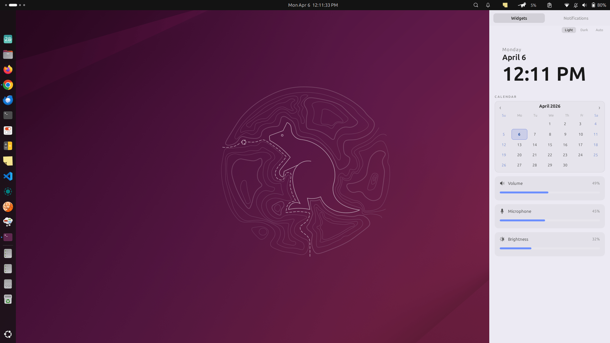

# Raven Sidebar

<p align="center">
  
</p>

A right-hand sidebar for GNOME Shell. It collects the things I kept opening separate menus for: media controls, quick toggles, audio and brightness sliders, a calendar, battery, and notifications. It slides in from the edge over a frosted-glass background and stays out of the way the rest of the time.




## What's in it

The sidebar has two tabs. The Widgets tab stacks:

- A clock and a month calendar you can page through
- **Now Playing** — title, artist, a scrubber, and play/skip controls for whatever's running. It talks to anything that speaks MPRIS (Spotify, browsers, most music apps).
- **Quick toggles** for Wi-Fi, Bluetooth, Do Not Disturb and Night Light
- Volume, microphone and brightness sliders
- **Battery** with time remaining and a power-profile switch, plus a separate battery-health readout
- A **habit tracker** — add a habit, tap it once a day, see the week at a glance
- Your local IP addresses

The Notifications tab mirrors the system tray: dismiss them one at a time or clear the lot.

By default the colours follow the system light/dark preference. You can pin it to light or dark from the strip at the top of the panel.

## Requirements

- GNOME Shell 45–50
- NetworkManager, UPower, and a PulseAudio or PipeWire setup — all standard on a normal GNOME desktop

Some widgets depend on optional pieces and simply hide themselves when those aren't around: the power-profile switch needs power-profiles-daemon, the brightness slider needs GNOME 49 or newer, and album art currently only shows for locally-stored files.

## Install

From source:

```bash
git clone https://github.com/dalpat/raven-sidebar.git
cd raven-sidebar
./install.sh
```

Then turn on "Raven Sidebar" in the Extensions app. On Wayland you have to log out and back in the first time before the shell will load it.

## Using it

Click the icon at the top-right of the panel, or press `Super + \`, to slide the sidebar in and out. Clicking anywhere outside it closes it.

## Settings

There's no preferences window yet, so the two settings live in GSettings:

```bash
# theme: system, dark, or light
gsettings set org.gnome.shell.extensions.raven-sidebar theme dark

# rebind the toggle shortcut
gsettings set org.gnome.shell.extensions.raven-sidebar toggle-raven "['<Super>n']"
```

## Developing

The code is plain ES modules, so there's no build step. `dev.sh` copies the extension into a nested GNOME Shell and launches it, which lets you test changes without disturbing your real session:

```bash
./dev.sh
```

Tests run with `npm test` (Vitest).

## License

GPL-2.0-or-later — see [LICENSE](LICENSE). Notes for contributors are in [CONTRIBUTING.md](CONTRIBUTING.md).
